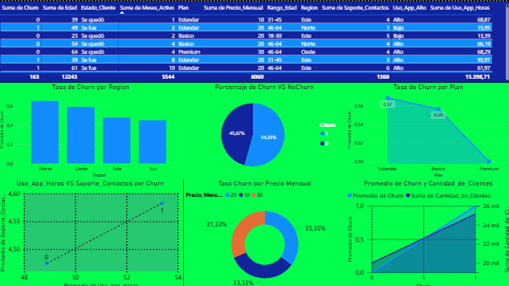
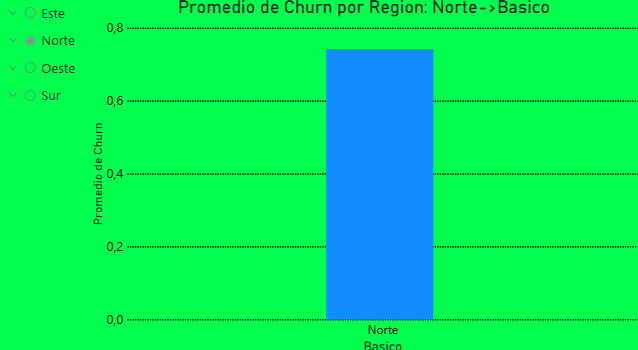

# 📊 Análisis de Churn (Pérdida de Clientes)

## 🧠 Descripción del Proyecto

Este proyecto tiene como objetivo analizar en profundidad el fenómeno de **churn (abandono de clientes)** para identificar patrones, causas y oportunidades de mejora en la retención.

A través del análisis de datos, se busca responder una pregunta clave:

> ¿Por qué los clientes se van y cómo podemos evitarlo?

---

## 🎯 Objetivos

- Identificar los factores que más influyen en el churn
- Detectar patrones de comportamiento en clientes que abandonan
- Analizar variables críticas como uso, antigüedad, soporte y plan contratado
- Proponer insights accionables basados en datos

---

## 🛠️ Tecnologías Utilizadas

- 🐍 Python (Pandas)
- 📊 Power BI (visualización de datos)
- 🤖 Inteligencia Artificial aplicada al análisis de datos
- 💻 IDE: Cursor
- 🔧 Git & GitHub

---

## 🧪 Metodología de Análisis

### 1. Limpieza de Datos
- Eliminación de valores nulos
- Normalización de variables
- Validación de tipos de datos

### 2. Transformación
- Creación de métricas clave (ej: tasa de churn)
- Segmentación por rangos (`pd.cut`)
- Agrupaciones estratégicas (`groupby`)

### 3. Análisis Exploratorio (EDA)
- Comparación de churn por:
  - Plan
  - Región
  - Uso de la aplicación
  - Meses activo
  - Contacto con soporte

### 4. Visualización
- Creación de dashboards en Power BI
- Identificación de patrones visuales claros

---

## 📊 Principales Hallazgos

El análisis reveló patrones críticos:

- ❌ Los clientes con **bajo uso de la app** tienen mayor churn
- ❌ Los clientes con **menos meses activos** abandonan más rápido
- ❌ Mayor número de **contactos con soporte** se asocia a mayor churn
- ❌ Algunos planes presentan mayor tasa de abandono

### 🔍 Insight clave:

> El churn no es aleatorio. Está directamente relacionado con el comportamiento del usuario y su experiencia con el servicio.

---

## 📈 Visualizaciones (Power BI)

### 📌 Gráfico 1

_Captura del dashboard_

---

### 📌 Gráfico 2

_Segunda captura_

---

## 🤖 Uso de Inteligencia Artificial

En este proyecto se aplicó IA de forma estratégica para:

- Optimizar el análisis exploratorio
- Detectar patrones ocultos en los datos
- Automatizar procesos de limpieza y transformación
- Acelerar la toma de decisiones basada en datos

---

## 🚀 Valor del Proyecto

Este análisis permite:

- Comprender el comportamiento real de los clientes
- Detectar problemas en la experiencia del usuario
- Reducir la pérdida de clientes (churn)
- Mejorar la rentabilidad del negocio

---

## 📌 Conclusión

El churn es un problema crítico pero **predecible**.

Mediante el uso de análisis de datos, es posible:

- anticipar la pérdida de clientes  
- identificar factores de riesgo  
- tomar decisiones estratégicas  

Este proyecto demuestra cómo el análisis de datos puede transformar información en **ventaja competitiva real**.

---

## 👨‍💻 Autor

**Aaron isaias Medina**
