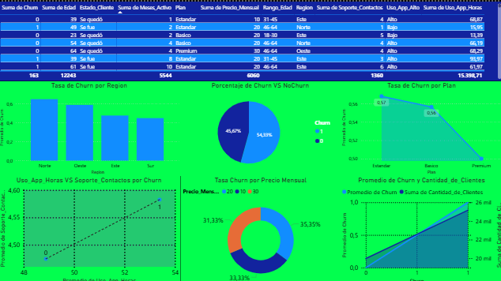
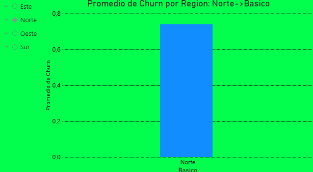

# 📊 Análisis de Churn de Clientes


---

# 📖 Descripción

La pérdida de clientes (**Customer Churn**) representa uno de los principales desafíos para cualquier empresa basada en suscripciones o servicios.

Este proyecto desarrolla un análisis integral de datos para identificar los factores que influyen en el abandono de clientes, utilizando técnicas de limpieza, transformación, exploración y visualización de datos.

El objetivo es convertir información histórica en conocimiento accionable que permita diseñar estrategias orientadas a mejorar la retención y aumentar la rentabilidad del negocio.

---

# 🎯 Problema de Negocio

Cada cliente que abandona un servicio representa una pérdida de ingresos y un aumento en los costos de adquisición de nuevos clientes.

Este proyecto responde preguntas fundamentales para la toma de decisiones:

- ¿Qué características tienen los clientes que abandonan el servicio?
- ¿Qué variables presentan mayor relación con el churn?
- ¿Qué segmentos poseen mayor riesgo de cancelación?
- ¿Qué acciones podrían reducir la pérdida de clientes?

---

# 🎯 Objetivos

- Analizar el comportamiento de los clientes.
- Identificar patrones asociados al abandono.
- Detectar variables críticas mediante análisis exploratorio.
- Generar información útil para apoyar decisiones estratégicas.
- Proponer recomendaciones orientadas a mejorar la retención.

---

# 🛠 Tecnologías Utilizadas

| Categoría | Tecnologías |
|-----------|-------------|
| Lenguaje | Python |
| Librerías | Pandas |
| Base de Datos | SQL Server |
| Visualización | Power BI |
| IA | Inteligencia Artificial aplicada al análisis |
| IDE | Cursor |
| Control de versiones | Git · GitHub |

---

# ⚙️ Metodología de Trabajo

## 1. Limpieza de Datos

- Eliminación de valores nulos.
- Corrección de inconsistencias.
- Validación de tipos de datos.
- Normalización de variables.

---

## 2. Transformación de Datos

- Construcción de métricas.
- Segmentación de clientes.
- Agrupación de información.
- Preparación de datos para el análisis.

---

## 3. Análisis Exploratorio (EDA)

Se analizaron variables relacionadas con:

- Tipo de plan.
- Región.
- Tiempo como cliente.
- Uso de la aplicación.
- Interacciones con soporte.
- Comportamiento de cancelación.

---

## 4. Visualización

Se desarrollaron dashboards interactivos en Power BI para facilitar la interpretación de los resultados y apoyar la toma de decisiones.

---

# 📊 Principales Hallazgos

El análisis permitió identificar patrones relevantes:

- Los clientes con menor uso de la aplicación presentan mayor probabilidad de abandono.
- Los clientes con menor antigüedad muestran una mayor tasa de churn.
- Un mayor número de contactos con soporte técnico se relaciona con una mayor probabilidad de cancelación.
- Determinados planes concentran una proporción superior de clientes perdidos.

---

# 💡 Insight Principal

> El abandono de clientes no ocurre de forma aleatoria; responde a patrones de comportamiento que pueden identificarse mediante análisis de datos y utilizarse para diseñar estrategias de retención.

---

# 📈 Dashboard

## Vista General



---

## Análisis Complementario



---

# 🤖 Aplicación de Inteligencia Artificial

Durante el desarrollo del proyecto se utilizó Inteligencia Artificial como herramienta de apoyo para:

- Optimizar el análisis exploratorio.
- Detectar patrones relevantes.
- Mejorar la productividad durante el desarrollo.
- Validar hipótesis analíticas.
- Documentar el proyecto.

---

# 💼 Valor para el Negocio

Este análisis permite a la organización:

- Reducir la pérdida de clientes.
- Mejorar la fidelización.
- Identificar segmentos de alto riesgo.
- Optimizar estrategias comerciales.
- Incrementar la rentabilidad mediante decisiones basadas en datos.

---

# 📂 Estructura del Proyecto

```text
Analisis-de-Churn/

│── data/
│── notebooks/
│── dashboard/
│── Visual1.png
│── Visual2.png
│── README.md
```

---

# 🚀 Próximas Mejoras

- Implementar un modelo predictivo de churn mediante Machine Learning.
- Automatizar el pipeline de análisis.
- Integrar nuevas fuentes de datos.
- Incorporar métricas avanzadas de retención.
- Publicar dashboards interactivos.

---

# 📌 Conclusión

El análisis demuestra que el abandono de clientes puede comprenderse mediante técnicas de análisis de datos y convertirse en una oportunidad para mejorar la estrategia del negocio.

La combinación de Python, SQL Server y Power BI permitió transformar datos en información estratégica para apoyar la toma de decisiones y generar valor para la organización.

---

# 👨‍💻 Autor

**Aaron Isaías Medina**

**Analista de Datos | SQL | Python | ETL | Power BI**
